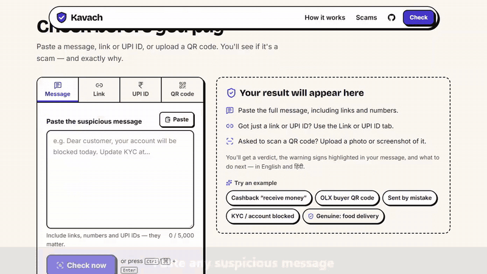
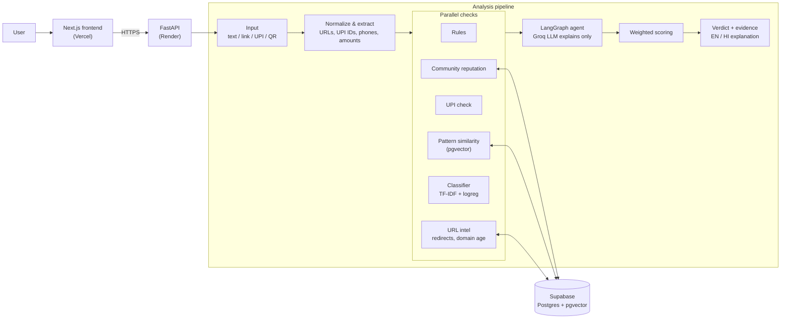

# Kavach 🛡️

**AI scam detector for India — paste any SMS, link, UPI ID or QR code and get an explainable verdict in English and हिंदी.**

[](https://github.com/UkatoSpeaks/Kavach/actions/workflows/ci.yml)


[](LICENSE)

**[Live demo](https://kavach-mu-blush.vercel.app)** · **[API health](https://kavach-api-mib4.onrender.com/health)**

> The API runs on Render's free tier and sleeps when idle, so the first request may take **~50 seconds** to wake it. After that it's fast.



## Why Kavach is not a spam filter

- **Fraud, not spam.** Three classes — genuine, promotion, scam. A loud sale SMS is annoying but safe; a polite "KYC update" link is not.
- **Checks real-world evidence.** Domain age (RDAP), short-link expansion, lookalike and brand-impersonating UPI IDs, decoded QR payloads (`upi://` collect vs pay), and community reports.
- **Explainable scoring.** Every signal's contribution is shown, and the evidence is highlighted in the original message.
- **Adversarially robust.** Handles leetspeak (`N0W`, `amaz0n`), zero-width and invisible characters, lookalike domains, and prompt injection aimed at the LLM.
- **Honest evaluation.** Metrics on held-out real Indian scams, with confidence intervals and a written list of caveats.

## Architecture



## Results

Held-out Indian messages — 155 real scams, 206 genuine, 86 promotions — none of which (nor any near-duplicate) was used for training or tuning. 95% intervals in brackets.

| | Precision | Scam recall | False-positive rate |
|---|---:|---:|---:|
| Rules only | 98.8% | 52.9% (45–61%) | 0.3% (0–2%) |
| Classifier only | 91.5% | 97.4% (94–99%) | 4.8% (3–8%) |
| **Rules + classifier (the API)** | **97.3%** | **93.5% (89–96%)** | **1.4% (1–3%)** |

Genuine messages flagged as suspicious or scam by the full API:

| Genuine set | Rules only | Rules + classifier |
|---|---:|---:|
| Indian (held-out) | 1 / 206 | 1 / 206 |
| UCI, UK/Singapore (never seen in training) | 0 / 690 | 1 / 690 |

The samples are small and most scams are public bank-KYC reports; see [docs/EVALUATION.md](docs/EVALUATION.md) for methodology and caveats.

## Key engineering decisions

| Decision | Why |
|---|---|
| **The LLM explains, it never decides** | The verdict comes from a weighted combination of deterministic signals. The LLM's opinion is a low-weight signal that can't make anything a scam on its own, so a jailbreak or hallucination can't flip a verdict. |
| **Hybrid rules + classifier** | Rules alone are precise but miss half the scams; the classifier alone flags 4.8% of genuine messages. Together: 93.5% recall at 1.4% FPR. |
| **Dependency-free classifier inference** | Trained with scikit-learn, exported to JSON, run with numpy — ~14 MB of RAM, so the whole API fits Render's 512 MB free tier. |
| **Entity masking + character n-grams** | Links, amounts and phones become tokens (`<url_lookalike>`, `<url_short>`…), so the model learns the scam shape, not specific numbers; char n-grams survive misspellings and leetspeak. |
| **Grouped template splits** | Near-duplicate messages are grouped before splitting, so no template appears in both train and test — otherwise the metrics would measure memorisation. |
| **Fail-soft signals** | Groq, Safe Browsing or the database can be down; the result is computed from the remaining signals and the missing one is reported. |
| **SSRF-safe link following** | A scam link is attacker-controlled input. Every redirect hop is resolved and private or loopback addresses are refused before it's fetched (the DNS-rebinding gap is documented in [DEPLOYMENT.md](docs/DEPLOYMENT.md#known-limitations)). |
| **Privacy** | Messages the author collected are test-only and never train the model (a test enforces it), and they're anonymised before being written to any dataset file. |

## Tech stack

| Layer | Technologies |
|---|---|
| Frontend | Next.js 16 (App Router), React 19, TypeScript, Tailwind CSS v4, Motion |
| Backend | Python, FastAPI, Pydantic v2, SQLAlchemy 2.0 (async), Alembic, httpx |
| AI / ML | LangGraph, Groq (`gpt-oss-120b` → `gpt-oss-20b` fallback), scikit-learn → numpy classifier, fastembed (multilingual MiniLM, ONNX) |
| Data | Supabase Postgres + pgvector |
| Infra | Render (API), Vercel (frontend), GitHub Actions CI, uv |

## Project structure

```
backend/
  app/          FastAPI app: routes, analysis pipeline, LangGraph agent, scoring
  ml/           dataset preparation, classifier training and evaluation
  models/       trained classifier (JSON)
  data/         scam-pattern knowledge base, dataset docs
  alembic/      database migrations
  scripts/      knowledge-base ingest, model download, memory measurement
  tests/        pytest suite (fast suite needs no DB or network)
frontend/       Next.js app: landing page, checker, shareable results
docs/           development, deployment and evaluation guides
render.yaml     Render Blueprint for the API
```

## Quick start

```powershell
# Backend (needs uv, a Supabase project and a Groq key)
cd backend; uv sync; Copy-Item .env.example .env   # fill in .env
uv run alembic upgrade head
uv run uvicorn app.main:app --reload               # http://127.0.0.1:8000/docs

# Frontend
cd ../frontend; Copy-Item .env.local.example .env.local; npm install; npm run dev
```

Full setup, tests and lint: [docs/DEVELOPMENT.md](docs/DEVELOPMENT.md). Deploying: [docs/DEPLOYMENT.md](docs/DEPLOYMENT.md).

## Limitations & roadmap

**Limitations**

- **Small Indian test set.** 155 held-out Indian scams, mostly public bank-KYC reports; UPI-specific tricks are rare in public data, so for those the rules do the work.
- **Free-tier constraints.** ~50 s cold starts, and Groq's free rate limits mean some explanations fall back to templates (verdicts never depend on Groq).
- **Pattern-similarity signal is off in production.** The embedding model needs ~560 MB; the free instance has 512 MB.
- **v1 scope is UPI and link fraud.** OTP/Aadhaar fraud, digital arrest, loan apps and investment scams are not covered yet.

**Roadmap**

- WhatsApp bot — forward a message, get a verdict
- Screenshot OCR
- Compare against a fine-tuned MuRIL transformer
- More real Indian data, especially UPI collect-request and QR scams

## Data & credits

The classifier is trained and evaluated on these public datasets. Our modifications (relabelling, anonymisation, deduplication, splitting) are described in [backend/data/datasets/README.md](backend/data/datasets/README.md).

| Dataset | Authors | Licence | Used for |
|---|---|---|---|
| [India Spam SMS Classification](https://github.com/junioralive/india-spam-sms-classification) | junioralive | MIT | train / val / held-out |
| [SMS Phishing Dataset for Machine Learning and Pattern Recognition](https://data.mendeley.com/datasets/f45bkkt8pr/1) | Sandhya Mishra, Devpriya Soni — Mendeley Data, V1, 2022, [doi:10.17632/f45bkkt8pr.1](https://doi.org/10.17632/f45bkkt8pr.1) | [CC BY 4.0](https://creativecommons.org/licenses/by/4.0/) | train / val / held-out |
| [Smishing Dataset IMC 2025](https://github.com/reportsmishing/Smishing-Dataset-IMC25) | S. Agarwal, A. Papasavva, G. Suarez-Tangil, M. Vasek — *Fishing for Smishing*, IMC 2025, [doi:10.1145/3730567.3764431](https://doi.org/10.1145/3730567.3764431) | [CC BY 4.0](https://creativecommons.org/licenses/by/4.0/) | train / val / held-out |
| [UCI SMS Spam Collection](https://archive.ics.uci.edu/dataset/228/sms+spam+collection) | T. A. Almeida, J. M. Gómez Hidalgo | [CC BY 4.0](https://creativecommons.org/licenses/by/4.0/) | evaluation only |

The datasets themselves are not redistributed in this repository; `ml/download_public.py` fetches them from the sources above.

## If you've been scammed

Call the national cybercrime helpline **1930** immediately, or report at **[cybercrime.gov.in](https://cybercrime.gov.in)**. The sooner you report, the better the chance of freezing the money.

## Author

Built by **Anurag** — [@UkatoSpeaks](https://github.com/UkatoSpeaks).

## Licence

Code released under the [MIT License](LICENSE). The datasets above keep their own licences.
